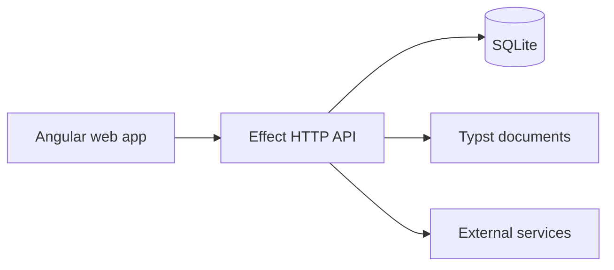

<div align="center">


# Backoffice

**Commercial operations, documents, accounting, and banking in one workspace.**

[](https://www.npmjs.com/package/@sachahjkl/backoffice)
[](https://github.com/sachahjkl/backoffice/actions/workflows/ci.yml)
[](https://angular.dev/)
[](LICENSE)

[Live demo](https://backoffice-demo.sacha.house/) · [Package](https://www.npmjs.com/package/@sachahjkl/backoffice) · [Development](#development) · [Deployment](#deployment) · [Demo](#demo)

</div>

---

Backoffice is a self-contained business management application. It combines an
Angular interface, an Effect API, SQLite persistence, and Typst documents in
one deployable package.

```text
Customers → Quotes → Orders → Invoices → Payments → Accounting
                         ↘ Banking ↗
```

> [!IMPORTANT]
> This repository is proprietary software. Obtain written permission before
> using, copying, running, modifying, or distributing it. See [License](#license).

## What it covers

| Area | Capabilities |
|---|---|
| **Sales** | Customers, affairs, quotes, orders, invoices, credit notes, and payments. |
| **Purchasing** | Suppliers, supplier invoices, approval, credit notes, and SEPA payment batches. |
| **Accounting** | Accounts, journals, entries, periods, VAT, FEC, statements, and audit history. |
| **Banking** | CAMT.053, OFX, and CSV imports with assisted reconciliation. |
| **Documents** | Versioned commercial documents and PDF generation with Typst. |
| **Communication** | Email templates, drafts, reminders, and provider integrations. |
| **Administration** | Teams, roles, passkeys, API tokens, branding, localization, and runtime settings. |

## Demo

Build the complete package, start a migrated SQLite instance, and query its
health endpoint.

<p align="center">
  <a href="docs/demo.cast">
    
  </a>
</p>

The animation comes from the committed [asciinema recording](docs/demo.cast).
The public demo uses synthetic data and isolated credentials.

## Architecture



The workspace separates contracts, localization, documents, API code, web
code, and deployment assembly:

```text
packages/contracts/   Shared request, response, and domain contracts
packages/l10n/        Translation catalogs and localization helpers
packages/documents/   Typst templates and document generation
packages/api/         Effect services, HTTP API, migrations, and SQLite
packages/web/         Angular application and design system
packages/app/         Standalone npm package assembly
```

The package ships the server, web assets, migrations, document templates, and
fonts together.

## Install

Obtain written permission before installing or running the package.

Install Node.js 26.7 or later, pnpm 11.25.0, and Typst. Then install the
application package:

```sh
npm install @sachahjkl/backoffice
```

Configure the required secrets through your secret manager:

```text
BOOTSTRAP_PASSWORD_SCRYPT
PASETO_SECRET_KEY
REFRESH_HMAC_KEY
API_TOKEN_HMAC_KEY
QUOTE_LINK_HMAC_KEY
```

Set the public origin and start the server:

```sh
export PUBLIC_ORIGIN=https://backoffice.example.com
export DATABASE_PATH=$PWD/data/backoffice.sqlite
npx froment-backoffice
```

Startup applies pending migrations before the server listens on port `3000`.

## Application commands

```sh
npx froment-backoffice start
npx froment-backoffice migrate
npx froment-backoffice backup
npx froment-backoffice demo-reset
```

The default command is `start`. Use `DATABASE_PATH`, `PORT`,
`BUSINESS_TIME_ZONE`, and `TYPST_PATH` to configure the local runtime.

For demo instances, set `APP_ENV=staging`, `DEMO_MODE=true`, `DEMO_PASSWORD`,
and a separate `DEMO_ACCOUNT_PASSWORD`. Never reuse production storage or
credentials.

## Development

Enter the reproducible development environment:

```sh
nix develop
```

Install dependencies and run the project checks:

```sh
pnpm install --frozen-lockfile
pnpm build
pnpm test
pnpm lint
pnpm format:check
```

Build the standalone application package:

```sh
pnpm build:app
npm pack --dry-run ./packages/app
```

The Nix flake exposes the application, OCI image, development shell, and CI
checks:

```sh
nix build .#default
nix build .#dockerImage
nix flake check "path:$PWD" --no-write-lock-file
```

## Deployment

Each instance owns its domain, SQLite volume, secrets, backups, and runtime
configuration. This repository builds the application but does not deploy an
instance.

Before an upgrade:

1. Create and verify a database backup.
2. Stop old workers before moving the database.
3. Restore into an isolated persistent volume.
4. Configure `PUBLIC_ORIGIN`, `APP_ENV`, and application secrets.
5. Start the new version and apply its migrations.
6. Verify `/api/health`, authentication, documents, and integrations.

The Nix package also provides migration, backup, preparation, and deployment
commands. The OCI image runs as an unprivileged user and stores data under
`/var/lib/froment-software`.

Read the operational guides before deployment:

- [Deployment](docs/deployment.md)
- [Backup and restore](docs/backups.md)
- [Secrets](docs/secrets.md)
- [Runtime configuration](docs/runtime-configuration.md)
- [External services](docs/external-services.md)

## Security and data integrity

- The API validates runtime configuration before startup.
- Role-based permissions protect business operations.
- Issued documents and validated accounting entries are immutable.
- Sensitive settings remain server-side and can use encrypted storage.
- Database migrations and backups are explicit operational steps.
- API documentation is available from `/api/docs` on a running instance.

## License

Copyright © 2026 Sacha Froment. All rights reserved.

This software is not open source. Access to the repository or npm package does
not grant permission to use it. Request permission through
[froment.software](https://froment.software) or
[contact@froment.software](mailto:contact@froment.software).

Read the complete [Froment Software License](LICENSE).
